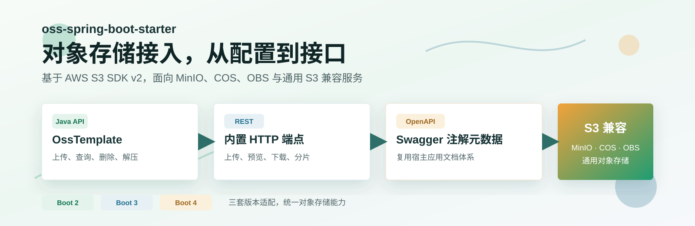
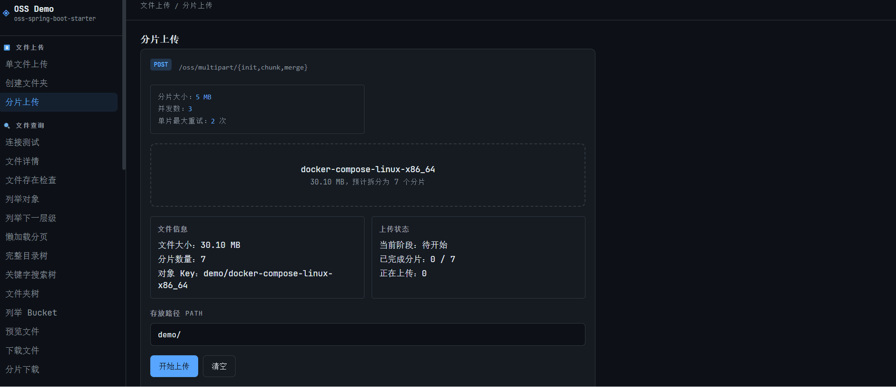
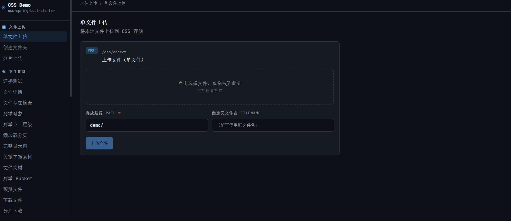

# oss-spring-boot-starter

[](https://github.com/weimin96/oss-spring-boot-starter/actions/workflows/ci.yml)
[](https://coveralls.io/github/weimin96/oss-spring-boot-starter?branch=main)
[](https://github.com/weimin96/oss-spring-boot-starter/releases/)
[](https://central.sonatype.com/artifact/io.github.weimin96/oss-spring-boot3-starter)
[](https://www.apache.org/licenses/LICENSE-2.0.html)

基于 AWS S3 SDK v2 的对象存储 Spring Boot Starter，支持 Spring Boot 2、Spring Boot 3、Spring Boot 4。项目按使用方式拆分为基础
Java API、内置 REST 接口、OpenAPI 注解元数据三类 Starter。



示例工程入口：[samples/README.md](samples/README.md)

前端在线演示页（GitHub Pages）：[https://weimin96.github.io/oss-spring-boot-starter/](https://weimin96.github.io/oss-spring-boot-starter/)

*该页面只托管前端静态资源*

## 演示效果

### 分片上传



### 全部功能



## 能力概览

### 核心能力
- **文件操作**：`OssTemplate` 提供统一入口，支持上传、下载、复制、移动、删除
- **大文件处理**：分片上传、分片下载，完整支持 HTTP Range 断点续传
- **流式解压**：ZIP 文件流式解压，支持跨 Bucket 和按前缀过滤
- **预签名 URL**：生成下载/上传预签名，支持临时授权访问
- **标签管理**：对象标签和 Bucket 标签的 CRUD 操作
- **MinIO 事件监听**：`oss.type=minio` 时支持对象创建、删除事件监听

### 查询能力
- 多种列表模式：递归列表、层级列举、游标分页懒加载
- 目录树：完整树形结构、关键字搜索、仅目录树
- 元数据查询：对象信息、连接测试、Bucket 详情

### Bucket 管理
- ACL 权限控制、版本控制、时间回滚
- 生命周期规则、CORS 配置、策略管理
- 服务端加密、公共访问屏蔽

### 多端点支持
- 基础 Java API：直接使用 `OssTemplate`
- 内置 REST 接口：Web Starter 提供完整 HTTP 端点
- OpenAPI 元数据：OpenAPI Starter 输出 Swagger 注解

### 兼容性与部署
- 存储类型：MinIO、腾讯云 COS、华为云 OBS、通用 S3 兼容服务
- Spring Boot 版本：2.x（javax.servlet）、3.x/4.x（jakarta.servlet）
- 模块化设计：按需引入，避免不必要的依赖

## 选择依赖

| 使用场景                   | Spring Boot 2                      | Spring Boot 3                      | Spring Boot 4                      |
|------------------------|------------------------------------|------------------------------------|------------------------------------|
| 只使用 Java API           | `oss-spring-boot2-starter`         | `oss-spring-boot3-starter`         | `oss-spring-boot4-starter`         |
| 使用 REST 接口（不带swagger）  | `oss-spring-boot2-web-starter`     | `oss-spring-boot3-web-starter`     | `oss-spring-boot4-web-starter`     |
| 使用 REST 接口（带swagger）   | `oss-spring-boot2-openapi-starter` | `oss-spring-boot3-openapi-starter` | `oss-spring-boot4-openapi-starter` |

基础 Starter 只创建 `OssTemplate`，不注册 REST 控制器。需要 HTTP 接口时请选择 Web Starter 或 OpenAPI Starter。

OpenAPI Starter 只提供 Swagger 注解元数据，不内置 Swagger UI。宿主应用可以继续使用自己的 springdoc 或其他 OpenAPI 集成。

## 安装

Spring Boot 3 基础 Java API 示例：

```xml
<dependency>
    <groupId>io.github.weimin96</groupId>
    <artifactId>oss-spring-boot3-starter</artifactId>
    <version>3.2.0</version>
</dependency>
```

Spring Boot 3 内置 REST 接口示例：

```xml
<dependency>
    <groupId>io.github.weimin96</groupId>
    <artifactId>oss-spring-boot3-web-starter</artifactId>
    <version>3.2.0</version>
</dependency>
```

Spring Boot 3 OpenAPI 注解接口示例：

```xml
<dependency>
    <groupId>io.github.weimin96</groupId>
    <artifactId>oss-spring-boot3-openapi-starter</artifactId>
    <version>3.2.0</version>
</dependency>
```

Spring Boot 4 基础 Java API 示例：

```xml
<dependency>
    <groupId>io.github.weimin96</groupId>
    <artifactId>oss-spring-boot4-starter</artifactId>
    <version>3.2.0</version>
</dependency>
```

Spring Boot 4 内置 REST 接口示例：

```xml
<dependency>
    <groupId>io.github.weimin96</groupId>
    <artifactId>oss-spring-boot4-web-starter</artifactId>
    <version>3.2.0</version>
</dependency>
```

Spring Boot 4 OpenAPI 注解接口示例：

```xml
<dependency>
    <groupId>io.github.weimin96</groupId>
    <artifactId>oss-spring-boot4-openapi-starter</artifactId>
    <version>3.2.0</version>
</dependency>
```

Web Starter 和 OpenAPI Starter 的 Spring Web、Validation 依赖在本项目中按 `provided` 处理。宿主 Web
应用需要已经引入以下依赖；如果你的应用已经有它们，不需要重复声明。

```xml
<dependency>
    <groupId>org.springframework.boot</groupId>
    <artifactId>spring-boot-starter-web</artifactId>
</dependency>
<dependency>
    <groupId>org.springframework.boot</groupId>
    <artifactId>spring-boot-starter-validation</artifactId>
</dependency>
```

## 基础配置

```yaml
oss:
  enable: true
  endpoint: http://127.0.0.1:9000
  bucket-name: oss-sample
  auto-create-bucket: true
  access-key: minioadmin
  secret-key: minioadmin
  type: minio
  max-connections: 50
  connection-timeout: 10000
  api-call-timeout: 600000
  api-call-attempt-timeout: 120000
  multipart-threshold-in-mb: 10
  part-size-in-mb: 10
  http:
    enable: true
    prefix: /api
  event:
    enable: false
    bucket-name: oss-sample
    events:
      - s3:ObjectCreated:*
      - s3:ObjectRemoved:*
    prefix: ""
    suffix: ""
    reconnect-interval: 5s

spring:
  servlet:
    multipart:
      max-file-size: 500MB
      max-request-size: 500MB
```

只使用基础 Java API 时，可以不配置 `oss.http`，或保持 `oss.http.enable=false`。

## 配置项

| 配置项                      | 类型      | 默认值     | 说明                              |
|--------------------------|---------|---------|---------------------------------|
| `oss.enable`             | boolean | `false` | 是否启用自动配置                        |
| `oss.endpoint`           | String  | 无       | 对象存储服务端点，启用后必填                  |
| `oss.bucket-name`        | String  | 无       | 默认 Bucket 名称，多数默认 Bucket 操作需要配置 |
| `oss.auto-create-bucket` | boolean | `false` | 默认 Bucket 不存在时是否自动创建            |
| `oss.access-key`         | String  | 无       | 访问密钥 ID，启用后必填                   |
| `oss.secret-key`         | String  | 无       | 访问密钥，启用后必填                      |
| `oss.type`               | String  | 无       | 存储类型，常用值为 `minio`、`cos`、`obs`   |
| `oss.max-connections`    | int     | `50`    | 最大连接数配置项                        |
| `oss.connection-timeout` | long    | `10000` | 连接超时时间，单位毫秒                     |
| `oss.api-call-timeout` | long | `600000` | 单次 API 调用总超时时间，单位毫秒 |
| `oss.api-call-attempt-timeout` | long | `120000` | 单次 API 尝试超时时间，单位毫秒，不能超过调用总超时 |
| `oss.multipart-threshold-in-mb` | int | `10` | 启用 multipart 的对象大小阈值，最小值为 5 MB |
| `oss.part-size-in-mb`    | int     | `10`    | multipart 最小分片大小，最小值为 5 MB                  |
| `oss.http.enable`        | boolean | `false` | 是否注册内置 REST 接口                  |
| `oss.http.prefix`        | String  | 空字符串    | REST 接口路径前缀                     |
| `oss.event.enable`       | boolean | `false` | 是否启用 MinIO 对象事件监听              |
| `oss.event.bucket-name`  | String  | 默认 Bucket | 监听事件的 Bucket 名称                  |
| `oss.event.events`       | List    | 创建、删除事件 | 监听的 S3 事件名称                     |
| `oss.event.prefix`       | String  | 空字符串    | 只监听指定对象前缀                      |
| `oss.event.suffix`       | String  | 空字符串    | 只监听指定对象后缀                      |
| `oss.event.reconnect-interval` | Duration | `5s` | 事件连接断开后的重连间隔                  |

## 客户端行为

底层使用标准 Java `S3AsyncClient`、Netty 异步 HTTP client 和 `S3TransferManager`。`oss.max-connections` 控制 HTTP
最大并发连接数，`oss.connection-timeout` 只限制建立连接所需时间，不限制一次完整的对象操作。

`oss.api-call-timeout` 是一次 API 调用包含所有重试和重试间隔的总时限；`oss.api-call-attempt-timeout` 是单次尝试的时限，必须小于
或等于调用总时限。大对象或低带宽环境应根据实际传输时间调高这两个值。

客户端默认启用 multipart。对象达到 `oss.multipart-threshold-in-mb` 后进入 multipart 处理，单个分片不小于
`oss.part-size-in-mb`。请求校验和计算与响应校验均使用 `WHEN_REQUIRED`，避免对不要求 checksum 的 S3 兼容服务改变协议行为。

Spring 容器销毁 `OssTemplate` 时会依次关闭 Presigner、Transfer Manager 和 S3 client。纯 Java 场景应在应用停止时调用
`OssTemplate.stop()`；即使某个资源关闭失败，其余资源仍会继续释放。

## 存储类型

| `oss.type` | 对象存储              | URL 拼接方式                                           |
|------------|-------------------|----------------------------------------------------|
| `minio`    | MinIO 或本地 S3 兼容服务 | Path-Style，格式为 `{endpoint}/{bucket}/`              |
| `cos`      | 腾讯云 COS           | Virtual-Hosted，格式为 `{protocol}://{bucket}.{host}/` |
| `obs`      | 华为云 OBS           | Virtual-Hosted，格式为 `{protocol}://{bucket}.{host}/` |
| 其他值或空值     | 通用 S3 兼容服务        | Path-Style 兜底                                      |

底层 S3 客户端目前只在 `oss.type=minio` 时强制 Path-Style 寻址。使用其他 S3 兼容服务时，请先在目标环境验证 endpoint 与
Bucket 寻址方式。

## Java API 用法

所有操作都从 `OssTemplate` 进入。

| 入口                      | 能力                                        |
|-------------------------|-------------------------------------------|
| `ossTemplate.put()`     | 上传文件、创建目录占位、复制、移动、分片上传                    |
| `ossTemplate.query()`   | 连接测试、对象元数据、列表、树形结构、下载、预览、按前缀流式 ZIP 导出      |
| `ossTemplate.delete()`  | 单个删除、批量删除、目录递归删除                          |
| `ossTemplate.unzip()`   | ZIP 流式解压、跨 Bucket 解压、按条目前缀过滤解压            |
| `ossTemplate.presign()` | 生成 GET/PUT 预签名 URL                        |
| `ossTemplate.tagging()` | 对象标签和 Bucket 标签                           |
| `ossTemplate.bucket()`  | Bucket 详情、ACL、版本控制、时间回滚、生命周期、CORS、策略、安全配置 |

上传示例：

```java
@RestController
@RequiredArgsConstructor
public class FileController {

    private final OssTemplate ossTemplate;

    @PostMapping("/upload")
    public String upload(@RequestParam("file") MultipartFile file) throws IOException {
        try (InputStream inputStream = file.getInputStream()) {
            ObjectInfo objectInfo = ossTemplate.put()
                    .putObject("uploads/", file.getOriginalFilename(), inputStream);
            return objectInfo.getUrl();
        }
    }
}
```

对象命令上传示例：

```java
Map<String, String> metadata = Collections.singletonMap("source", "archive-job");
Map<String, String> tags = Collections.singletonMap("environment", "production");

try (InputStream inputStream = Files.newInputStream(file)) {
    PutObjectCommand command = new PutObjectCommand(
            "archive-bucket",
            "uploads/demo.bin",
            inputStream,
            Files.size(file),
            "application/octet-stream",
            metadata,
            tags,
            checksumSha256,
            false
    );
    StoredObject storedObject = ossTemplate.put().putObject(command);
}
```

`checksumSha256` 使用 Base64 编码的 SHA-256。未知长度流上传时将 `contentLength` 设为 `null`，客户端会根据 multipart 配置流式处理。
`createOnly=true` 会发送 `If-None-Match: *`，其原子条件写语义取决于目标 S3 兼容服务是否支持。

复制与元数据查询示例：

```java
StoredObject copied = ossTemplate.put().copyObject(new CopyObjectCommand(
        "source-bucket",
        "uploads/demo.bin",
        "archive-bucket",
        "archive/demo.bin"
));

StoredObject metadata = ossTemplate.query().headObject(
        "archive-bucket",
        "archive/demo.bin"
);
```

`move()` 保持允许覆盖目标对象的兼容语义。内部使用 `.oss-staging/move/` 随机 key 完成 staging-copy-delete，校验 staging
和最终对象后再删除源对象；如果 staging、复制、校验或清理失败，源对象会保留并显式抛出异常。

查询与预签名示例：

```java
ObjectInfo objectInfo = ossTemplate.query().getObjectInfo("uploads/demo.txt");

boolean exists = ossTemplate.query().checkExist("uploads/demo.txt");

String downloadUrl = ossTemplate.presign()
        .generateGetPresignedUrl("uploads/demo.txt", Duration.ofMinutes(10));
```

MinIO 文件变化监听示例：

```yaml
oss:
  enable: true
  type: minio
  bucket-name: oss-sample
  event:
    enable: true
    events:
      - s3:ObjectCreated:*
      - s3:ObjectRemoved:*
    prefix: uploads/
    reconnect-interval: 5s
```

```java
@Component
public class ObjectEventHandler implements OssObjectEventListener {

    @Override
    public void onObjectChanged(OssObjectEvent event) {
        String bucketName = event.getBucketName();
        String objectKey = event.getObjectKey();
        String eventName = event.getEventName();
    }
}
```

该能力只在 `oss.type=minio` 时生效，使用 MinIO 扩展监听接口，不引入 MinIO SDK 和消息队列。事件可能重复、延迟或在断线重连期间丢失，业务侧处理应保持幂等。

文件夹压缩下载示例：

```java
@GetMapping("/files/folder/download")
public void downloadFolder(
        @RequestParam String path,
        @RequestParam(required = false) String filename,
        HttpServletResponse response) throws IOException {
    String zipFilename = (filename == null || filename.trim().isEmpty())
            ? "folder-download.zip"
            : (filename.endsWith(".zip") ? filename : filename + ".zip");

    response.setContentType("application/zip");
    response.setHeader("Content-Disposition", "attachment; filename=\"" + zipFilename + "\"");
    ossTemplate.query().writeFolderAsZip(path, response.getOutputStream());
}
```

说明：

- `path` 表示 S3 prefix，而不是真实文件夹。
- 目录占位对象不会写入 ZIP，只有 prefix 下的真实对象会按相对路径进入压缩包。
- 当前缀为空、prefix 下没有真实对象，或对象流读取失败时，接口会显式失败，不返回空 ZIP。

更多示例参考：[samples/README.md](samples/README.md) 或 [JavaxOpenApiOssControllerSupport.java](oss-spring-javax-web-support/src/main/java/com/wiblog/oss/controller/support/JavaxOpenApiOssControllerSupport.java)

前端示例工程已补充“文件夹压缩下载”页面，后端示例工程已补充 `/api/files/folder/download` 自定义控制器用法。

## 内置 REST 接口

启用条件：

- 引入对应版本的 Web Starter 或 OpenAPI Starter。
- 宿主应用是 Spring Web 应用。
- 配置 `oss.enable=true`。
- 配置 `oss.http.enable=true`。

所有路径都以 `${oss.http.prefix}/oss` 为前缀。示例配置 `oss.http.prefix=/api` 时，完整前缀为 `/api/oss`。

除预览、单对象下载和文件夹压缩下载接口直接输出二进制流外，其他接口统一返回 `OssResponse`。

### 分片上传

| 方法     | 路径                 | 说明        |
|--------|--------------------|-----------|
| `POST` | `/multipart/init`  | 初始化分片上传任务 |
| `POST` | `/multipart/chunk` | 上传单个分片    |
| `POST` | `/multipart/merge` | 合并分片      |
| `GET`  | `/multipart/parts` | 查询已上传分片列表 |

### 文件上传与删除

| 方法       | 路径         | 说明       |
|----------|------------|----------|
| `POST`   | `/object`  | 上传单个文件   |
| `POST`   | `/folder`  | 创建目录占位对象 |
| `DELETE` | `/object`  | 删除单个对象   |
| `DELETE` | `/objects` | 批量删除对象   |
| `DELETE` | `/folder`  | 递归删除目录   |

### 文件查询

| 方法     | 路径                             | 说明                  |
|--------|--------------------------------|---------------------|
| `GET`  | `/object`                      | 查询对象元数据             |
| `GET`  | `/object/exists`               | 检查对象是否存在            |
| `GET`  | `/object/list`                 | 递归列举对象              |
| `GET`  | `/object/list/next-level`      | 列举下一层级文件和目录         |
| `GET`  | `/object/list/lazy`            | 游标分页懒加载列表           |
| `GET`  | `/object/tree`                 | 获取目录树               |
| `GET`  | `/object/tree/search`          | 按关键字搜索目录树           |
| `GET`  | `/object/tree/folder`          | 获取仅包含目录的树           |
| `GET`  | `/buckets`                     | 列举当前凭证可见的 Bucket    |
| `GET`  | `/buckets/{bucketName}`        | 查询 Bucket 聚合详情      |
| `GET`  | `/buckets/{bucketName}/access` | 查询 Bucket ACL       |
| `PUT`  | `/buckets/{bucketName}/access` | 设置 Bucket ACL       |
| `POST` | `/buckets/{bucketName}/rewind` | 按时间回滚 Bucket 当前可见状态 |
| `GET`  | `/connect`                     | 测试默认 Bucket 连通性     |

### 预览、下载、复制、移动

| 方法     | 路径                    | 说明                      |
|--------|-----------------------|-------------------------|
| `GET`  | `/object/preview/**`  | 内联预览对象，支持 HTTP Range    |
| `GET`  | `/object/download/**` | 以附件方式下载对象，支持 HTTP Range |
| `GET`  | `/folder/download`    | 按 `path` 指定的 prefix 流式压缩下载 ZIP |
| `POST` | `/object/copy`        | 复制对象                    |
| `POST` | `/object/move`        | 移动对象到目标目录               |

`/folder/download` 参数说明：

- `path`：必填，表示 S3 prefix。
- `filename`：可选，自定义 ZIP 文件名；未传时默认使用 prefix 最后一级名称。

该接口不会把目录占位对象写入 ZIP。若 `path` 为空、prefix 下没有真实对象，或对象流读取失败，会直接返回错误响应，不返回空 ZIP。

### 解压与预签名

| 方法     | 路径                    | 说明                   |
|--------|-----------------------|----------------------|
| `POST` | `/unzip`              | 在默认 Bucket 内流式解压 ZIP |
| `POST` | `/unzip/cross-bucket` | 跨 Bucket 流式解压 ZIP    |
| `POST` | `/unzip/filter`       | 按条目前缀过滤解压            |
| `GET`  | `/presign/get`        | 生成下载预签名 URL          |
| `GET`  | `/presign/put`        | 生成上传预签名 URL          |

### 标签与 Bucket 管理

| 方法       | 路径                             | 说明              |
|----------|--------------------------------|-----------------|
| `GET`    | `/object/tags`                 | 获取对象标签          |
| `PUT`    | `/object/tags`                 | 覆盖设置对象标签        |
| `PATCH`  | `/object/tags`                 | 合并更新对象标签        |
| `DELETE` | `/object/tags`                 | 删除对象标签          |
| `POST`   | `/bucket`                      | 创建 Bucket       |
| `GET`    | `/bucket/versioning`           | 查询版本控制状态        |
| `PUT`    | `/bucket/versioning/enable`    | 启用版本控制          |
| `PUT`    | `/bucket/versioning/suspend`   | 挂起版本控制          |
| `GET`    | `/bucket/lifecycle`            | 查询生命周期规则        |
| `POST`   | `/bucket/lifecycle/expiration` | 添加过期删除规则        |
| `DELETE` | `/bucket/lifecycle`            | 删除生命周期规则        |
| `GET`    | `/bucket/cors`                 | 查询 CORS 配置      |
| `PUT`    | `/bucket/cors/allow-all`       | 设置允许所有来源的 CORS  |
| `DELETE` | `/bucket/cors`                 | 删除 CORS 配置      |
| `GET`    | `/bucket/policy`               | 查询 Bucket 策略    |
| `PUT`    | `/bucket/policy`               | 设置 Bucket 策略    |
| `DELETE` | `/bucket/policy`               | 删除 Bucket 策略    |
| `PUT`    | `/bucket/encryption/enable`    | 启用 SSE-S3 服务端加密 |
| `PUT`    | `/bucket/public-access/block`  | 开启公共访问屏蔽        |
| `GET`    | `/bucket/tags`                 | 获取 Bucket 标签    |
| `PUT`    | `/bucket/tags`                 | 覆盖设置 Bucket 标签  |
| `DELETE` | `/bucket/tags`                 | 删除 Bucket 标签    |

## 许可证

[Apache License 2.0](LICENSE)
